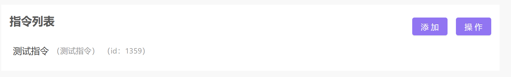
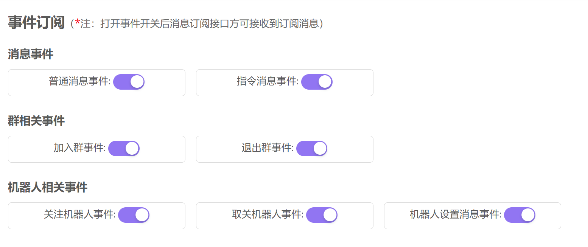
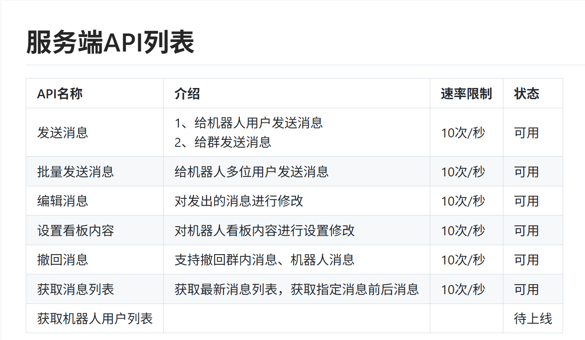

## 官方 API 接口

[云湖机器人开发文档](https://www.yhchat.com/c/p/29306)

后续开发请对接开发文档

## 已经实现的功能

1. 加群欢迎
2. 退群后台打印
3. 关注欢迎
4. 取消关注后台打印
5. 根据指令回复消息
6. 回复用户信息

## 说明

本仓库基于官方开源 [Python SDK](https://github.com/yhchat/bot-python-sdk) 开发。

官方 SDK 仅有一项示例，并且没有注释和说明，不利于后续开发。

在此基础上，本仓库对其示例进行了结构调整，将各项功能进行分离，并添加了注释，提高了可读性。

但本仓库并非一个功能完整的机器人，与数据库的交互还需自行解决。

## 如何快速将项目跑起来

1. 创建机器人并添加一条指令

云湖控制台中创建机器人

2. 修改 openapi

在云湖[控制台](https://www.yhchat.com/control)中

将所有的订阅消息勾选

在 `main.py` 中将 `token` 替换为你的 `token`

3. 修改指令 id

修改 `MessageInstruction.py` 中的指令 id 为你所创建的 id

就可以根据指令触发回复

这里只提供了一个示例指令，可以根据具体需求添加其他指令

4. 内网穿透

将服务的端口（默认 7888）通过 FRP 穿透出去，有几个注意点

1. 国内服务穿透，http 可能无法使用，需想办法使用 https，甚至可能需要备案

2. 建议使用国外节点，无任何要求，处于安全性考虑，有条件的话同样建议使用 https

3. 带宽要求不高，因为云湖本身对消息收发次数就有限制

## 注意

本仓库纯个人兴趣开发，无任何售后服务